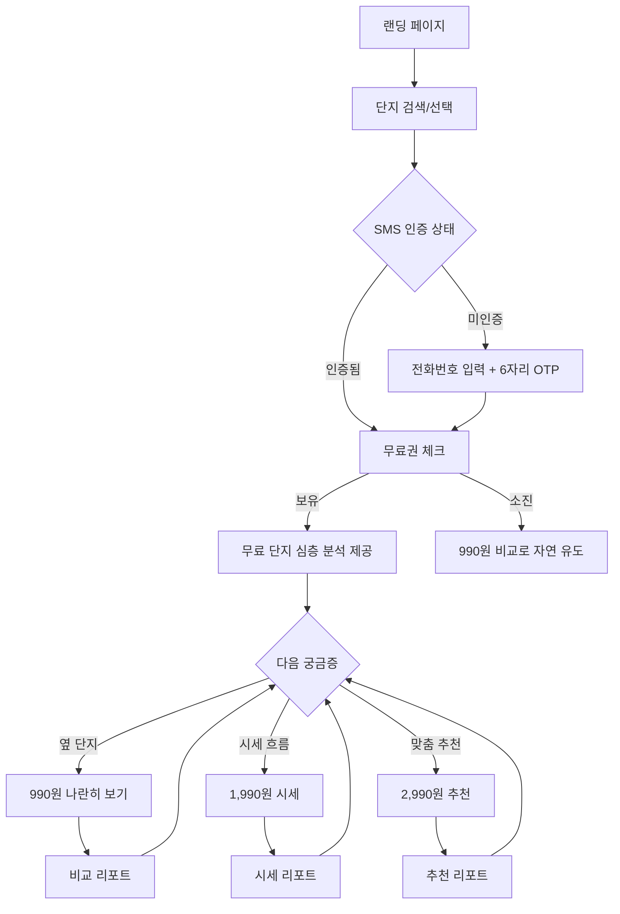

# 🏘️ 부동산 입지비교 서비스 기획서 (입지990)

> 사주990의 **소액 콘텐츠 결제 모델**을 부동산 입지분석에 적용.
> **"내가 아는 단지는 공짜로 제대로, 옆 단지와 나란히 보기는 딱 990원"**
> 박리다매 · 무저항 진입 · 궁금증 꼬리잡기 업셀.

---

## 1. 핵심 전략 (세 줄 요약)

1. **무료 = 완결된 단일 단지 심층 분석** (계정당 1회). "맛보기"가 아니라 "진짜 리포트".
2. **990원 = 옆 단지와 나란히 보기**. 비교라는 부동산 매수자의 본능 자극.
3. **업셀은 궁금증 꼬리잡기**. 부동산 무게감 배제, "커피 한 입 값" 톤.

### 왜 이 구조인가

- 사주990식 "맛보기 공짜"는 박탈감을 주지만, 입지990은 **수직 깊이를 먼저 준다**. → 신뢰 선결제, 비교 욕구는 자연 전환.
- 진입장벽 제로: 소셜 로그인 강요 없음. **SMS 인증 한 번**으로 무료 리포트 오픈.
- 박리다매: **990 / 1,990 / 2,990원** 3단 가격대. 심리 저항선 밑에서 회전.

---

## 2. 사주990 벤치마크 비교

| 항목 | 사주990 | 입지990 |
|------|---------|---------|
| **입력** | 생년월일, 성별, 시간 | 단지명 (검색/자동완성) |
| **분석** | AI 사주 알고리즘 | 공공 API + Claude |
| **결과** | 텍스트 리포트 | 입지 리포트 (교통/학군/시세/편의/AI 총평) |
| **무료 영역** | 맛보기 (일부) | **단일 단지 완결 분석** |
| **유료 전환점** | 세부 항목 결제 | **비교 = 990원** (나란히 보기) |
| **가격대** | 990원~ | **990 / 1,990 / 2,990원** |
| **인증** | 카카오 로그인 | **SMS 인증** (소셜은 선택) |

---

## 3. 서비스 컨셉

### 서비스명
**입지990** — 사주990 오마주 + "990원" 심리 가격 각인.

### 핵심 가치

> "내가 지금 아는 단지, 제대로 한 번 정리해드려요. 공짜로.
> 옆 단지랑 나란히 놓고 비교하고 싶으면? **딱 990원.**"

### 타겟 사용자

| 페르소나 | 설명 | 무료 진입 | 결제 전환 |
|---------|------|:---:|:---:|
| **예비 매수자** | 첫 집 장만, 후보 단지 고민 | ⭐⭐⭐⭐⭐ | ⭐⭐⭐⭐⭐ |
| **갈아타기 검토자** | 현재 집 매도 후 이동 고민 | ⭐⭐⭐⭐⭐ | ⭐⭐⭐⭐⭐ |
| **관심 단지 지켜보는 사람** | 내 관심 단지 한 번 정리 | ⭐⭐⭐⭐⭐ | ⭐⭐⭐ |
| **학부모** | 학군 중심 비교 | ⭐⭐⭐⭐ | ⭐⭐⭐⭐ |

---

## 4. 콘텐츠 · 가격 설계

### 4.1 무료와 유료의 경계 (철학)

> **"수직 깊이는 다 드립니다. 수평 맥락은 유료."**

| 구분 | 무료 포함 | 유료 이관 |
|------|----------|----------|
| 단지 단독 정보 | ✅ 교통/학군/편의/세대구성 | - |
| 시세 현황 (최근 실거래가) | ✅ 절대값 | - |
| AI 단독 총평 | ✅ 단지 하나에 대한 해설 | - |
| **상대 평가** | ❌ | ✅ 급지 랭킹, 동급 대비 저·고평가, 상승률 백분위 |
| **2~3개 나란히 비교** | ❌ | ✅ 990원 |
| **시세 흐름/추이** | ❌ (최근값만) | ✅ 1,990원 |
| **조건 기반 맞춤 추천** | ❌ | ✅ 2,990원 |

### 4.2 상품 구성

| 상품 | 입력 | 결과 | 가격 |
|------|------|------|:---:|
| **🆓 단지 심층 분석** (계정당 1회) | 단지 1개 | 교통/학군/편의/시세현황 + AI 단독 총평 | **무료** |
| **📊 나란히 보기** | 단지 2~3개 | 비교표 + 상대평가 + AI 비교 총평 | **990원** |
| **📈 시세 흐름 한 장** | 단지 1개 | 실거래가 추이, 상승률, 전세가율 | **1,990원** |
| **🎯 나한테 맞는 곳** | 예산 + 통근지 + 우선순위 | AI 추천 TOP 5 + 사유 | **2,990원** |

> 2회차 이후 단일 단지 심층 분석이 필요하면 → "나란히 보기 990원"으로 자연 유도
> (여러 단지를 한 번에 분석할 수 있어 사용자 체감 가치 ↑).

### 4.3 업셀 카피 가이드 ("부동산" 무게 빼기)

| ❌ 금지 | ✅ 권장 |
|--------|---------|
| 투자 판단 | 고민 정리 |
| 매수 분석 | 어디가 나한테 맞을까 |
| 입지 평가 리포트 | 나란히 놓고 보기 |
| 부동산 심층 분석 | 한 장 더 보기 |
| 프리미엄 리포트 | 딱 990원, 커피 한 입 값 |
| 결제하기 | 옆 단지랑 나란히 보기 → 990원 |
| 리포트 구매 | 990원으로 답 듣기 |

### 4.4 업셀 퍼널 (궁금증 꼬리잡기)

```
[무료: 이 단지 분석]
   ↓ "옆 단지는 어때요?"
[990원: 나란히 보기]
   ↓ "가격 요즘 어떻게 움직여요?"
[1,990원: 시세 흐름 한 장]
   ↓ "제 예산이면 어디가 맞을까요?"
[2,990원: 나한테 맞는 곳]
```

---

## 5. 사용자 플로우



---

## 6. 기술 스택 & 데이터

### 6.1 기술 스택

| 레이어 | 기술 | 사유 |
|--------|------|------|
| **프론트엔드** | Next.js 14 (App Router) + TypeScript | SSR + SEO |
| **스타일링** | Tailwind CSS | 빠른 UI |
| **백엔드** | Next.js API Routes | 풀스택 단일 프레임워크 |
| **DB** | Supabase (PostgreSQL) | 무료티어, Auth 내장 |
| **인증** | **Supabase Phone Auth + NCP SENS** | SMS 6자리 OTP (소셜은 선택) |
| **결제** | 토스페이먼츠 | 소액결제 최적화 |
| **AI** | Claude API | 긴 리포트 생성 강점 |
| **차트** | Recharts | 시세 그래프 |
| **배포** | Vercel | Next.js 최적 |
| **분석** | GA4 + Mixpanel | 퍼널 분석 |

### 6.2 데이터 소스

| 데이터 | 소스 | 비용 |
|--------|------|:---:|
| 단지 기본정보 | 공공데이터포털 (국토부 API) | 무료 |
| 실거래가 | 국토부 실거래가 공개시스템 | 무료 |
| 학군 정보 | 학교알리미 API | 무료 |
| 지하철 거리 | 카카오맵 API | 무료~저가 |
| **SMS 인증** | NCP SENS (또는 Aligo) | 건당 8~9원 |
| AI 리포트 | Claude API | 건당 ~100원 |

### 6.3 인증 · 결제 설계

| 항목 | 선택 | 사유 |
|------|------|------|
| **기본 인증** | SMS 6자리 (phone = 사용자 ID) | 진입장벽 최소, 재마케팅 루프 확보 |
| **부가 인증** | 카카오 OAuth (선택) | 기기 이동/이관용 |
| **결제 방식** | 토스페이먼츠 단건 | 구독 대비 저항 낮음 |
| **비회원 결제** | 허용 (결제 번호 = 식별자) | "결제만 하러 온 사람" 이탈 방지 |
| **재결제 유도** | 크레딧 충전 (Phase 2로 당김) | 박리다매 회전율 증가 |

---

## 7. 개발 로드맵

### Phase 1: MVP (2주)

| 주차 | 작업 |
|:---:|------|
| 1주 | Next.js 셋업, 랜딩, 공공 API 연동, Supabase 스키마 |
| 1주 | 단지 검색 + 자동완성, 단지 캐싱 |
| 2주 | **SMS 인증** (NCP SENS), 무료 단지 심층 분석 생성 |
| 2주 | 토스페이먼츠 (**990원 나란히 보기**), 리포트 열람 |

### Phase 2: 업셀 확장 (2주)

| 주차 | 작업 |
|:---:|------|
| 3주 | 시세 흐름 리포트 (1,990원), 맞춤 추천 (2,990원) |
| 3주 | 마이페이지 (번호 기반 보관함), 재열람 |
| 4주 | GA4/Mixpanel 퍼널, 카피 A/B 테스트 |
| 4주 | **크레딧 충전 팩** (3천원/5천원), 재결제 루프 |

### Phase 3: 성장

- **SEO 랜딩 자동생성** (`/compare/헬리오시티-vs-파크리오` 식)
- **카카오톡 공유 → 500원 쿠폰** 리워드
- **관심 단지 시세 변동 SMS 알림** → 재방문 루프
- B2B (공인중개사 대시보드)

---

## 8. 수익 시뮬레이션 (박리다매 재조정)

### 가정

| 항목 | 수치 |
|------|:---:|
| 월 방문자 | 10,000명 |
| SMS 인증 → 무료 리포트 전환 | 40% (4,000건) |
| 무료 → 990원 유료 전환 | 15% (600건) |
| 990원 → 추가 업셀 | 25% (150건) |
| 평균 결제 단가 | 약 1,300원 |
| **월 매출** | **약 97만원** |

### 성장 시나리오

| 시점 | 월 방문 | 무료→유료 | 업셀 | 월 매출 |
|:---:|:---:|:---:|:---:|:---:|
| 3개월 | 10,000 | 15% | 25% | ~100만원 |
| 6개월 | 40,000 | 18% | 30% | ~500만원 |
| 12개월 | 120,000 | 20% | 35% | ~1,800만원 |

### 비용 구조

| 항목 | 월 비용 |
|------|:---:|
| Vercel Pro | ~2만원 |
| Supabase Pro | ~3만원 |
| Claude API | ~10~15만원 |
| NCP SENS (SMS) | ~4만원 (월 5천건) |
| 토스페이먼츠 수수료 | ~3.5% |
| **합계** | **~25만원** |

---

## 9. 리스크 & 대응

| 리스크 | 영향 | 대응 |
|--------|:---:|------|
| 공공 API 불안정/변경 | 높음 | Supabase 캐싱 + 크롤링 백업 |
| 데이터 정확도 이슈 | 높음 | 출처 명시 + "참고용" 면책 고지 |
| **법적 리스크** (유사투자자문) | **높음** | "추천" 금지, "데이터 비교/정보 제공" 톤 통일, 법무 체크 |
| AI 환각 | 중간 | 숫자는 DB 원본만, AI는 해석만 |
| SMS 남용 (재전송 공격) | 중간 | 번호당 1분 쿨다운, 일일 5회 제한 |
| 990원 저항 | 낮음 | 무료 리포트 퀄리티로 신뢰 선결제 |

---

## 🔗 관련 노트

- [[입지990 백로그]] — 실행 문서 (이 기획서는 전략, 저건 실행)
- [[여의도 갈아타기 전략]]
- [[24년 매수 결정 복기 분석]]
- [[여의도 경유지 추천 단지]]
